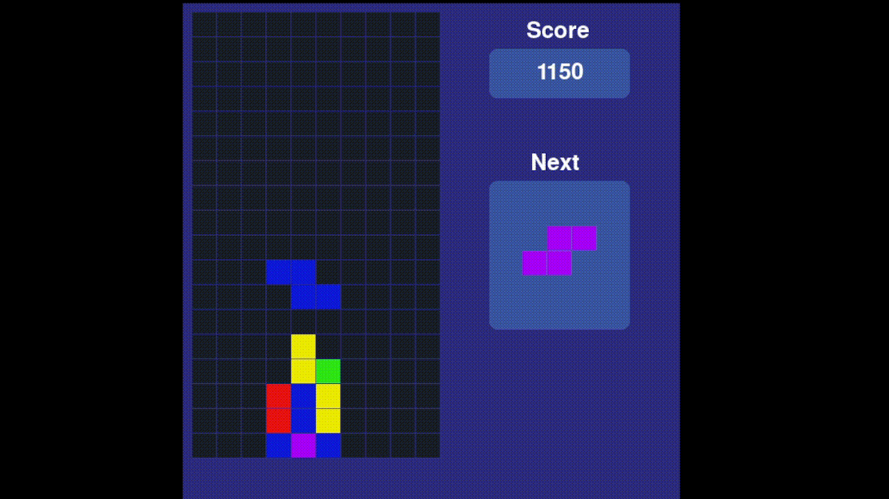
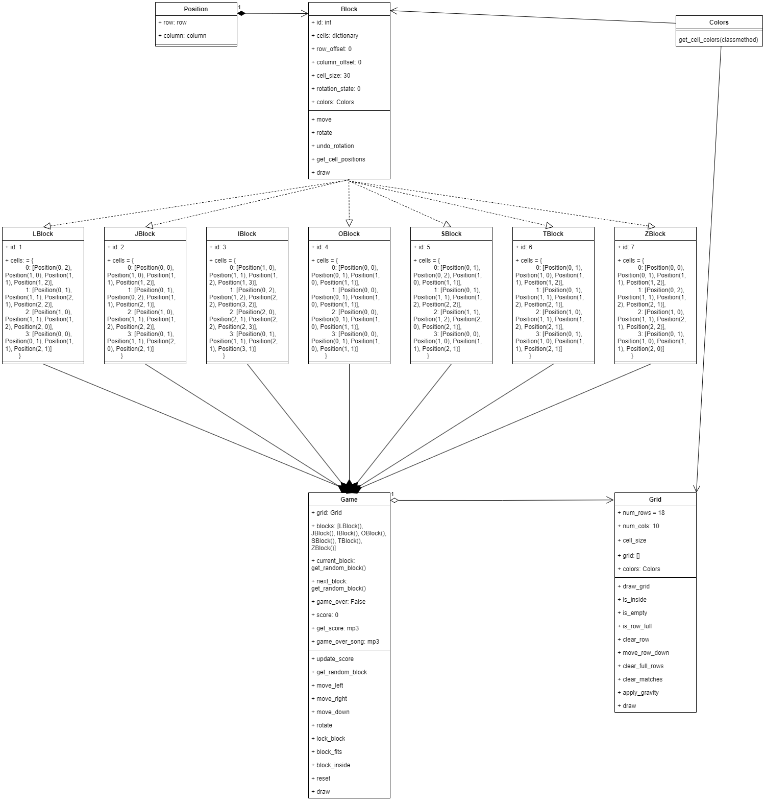

# Final Project: Tetris Crush

## Team Members

- **Carlos Santiago Gongora Ramirez**  
  Code: `20221020049`

- **Heylin Daniela Hernandez Perez**  
  Code: `20221020006`

- **Alejandro Gomez Moyano**
- Code: `20222020073`

## Requirements

According to the established guidelines, the final project consists of modeling and building a game that meets the rules of **Tetris Crush**.

- **Board:**  
  A 10x18 board is used.

- **Pieces:**  
  The traditional Tetris shapes will fall on the board following the conventional Tetris mechanics.  
  The shapes are composed of small boxes (cells) of different colors.  
  The number of different colors will introduce an additional level of difficulty.

- **Falling Logic:**  
  The game continuously checks that pieces in mid-air keep falling.

- **Match and Elimination Rules:**
  - **Match 3:**  
    When a horizontal or vertical line of 3 blocks of the same color is formed, the Tetris shape is destroyed and the boxes that form the match are removed.
  - **Match 4:**  
    When 4 blocks in a line of the same color (vertical or horizontal) are formed, not only the 4 blocks are removed, but also the entire row or column is eliminated.
  - **Match 5:**  
    When 5 blocks in a line of the same color are formed, all boxes of that color on the board are removed, effectively breaking any pieces that contain them.
  - **Match 6:**  
    When 6 blocks in a line of the same color are formed, every box on the board is removed and the board is reset without losing the score.

- **Losing Condition:**  
  The game is lost when there is no more space for new pieces on the board.

- **Project Support and Language:**  
  The project must be well-supported (documented) and can be developed in any programming language of your choice.




## Class Structure and Relationships

The game code is structured into several classes and modules, which relate to each other as follows:

- **Game**  
  - **Role:** The main controller of the game.
  - **Responsibilities:**  
    - Manages the game logic: moving pieces, locking pieces, updating the score, handling music and sound effects, etc.
    - Manages the active pieces by maintaining the current piece and the next piece, which are obtained from a list of blocks.
  - **Relationships:**  
    - Uses the **Grid** class to manage the game board.
    - Instantiates the pieces via the classes derived from **Block** (e.g., **LBlock, JBlock, IBlock, OBlock, SBlock, TBlock, ZBlock**).

- **Grid**  
  - **Role:** Represents the game board (a 10x18 matrix).
  - **Responsibilities:**  
    - Draws the board.
    - Checks if a cell is empty.
    - Determines if a row is complete and clears rows.
    - Detects matches and applies block eliminations and gravity.
  - **Relationships:**  
    - Receives locked pieces from **Game** and inserts them into the grid.

- **Block**  
  - **Role:** Base class for the game pieces (tetrominoes).
  - **Responsibilities:**  
    - Defines common properties (identifier, row and column offsets, cell size, rotation state).
    - Provides methods to move, rotate, and draw the piece.
    - Uses the **Position** class to manage the coordinates of each cell that composes the piece.
  - **Relationships:**  
    - Inherited by the specific piece classes: **LBlock, JBlock, IBlock, OBlock, SBlock, TBlock, ZBlock**.

- **LBlock, JBlock, IBlock, OBlock, SBlock, TBlock, ZBlock**  
  - **Role:** Derived classes from **Block** that define the specific shapes.
  - **Responsibilities:**  
    - Each class defines the particular shape of the piece in its different rotation states.
    - They apply initial offsets to correctly position the piece on the board.

- **Position**  
  - **Role:** Represents a coordinate on the board.
  - **Responsibilities:**  
    - Stores the row and column of a cell.
  - **Relationships:**  
    - Used by **Block** and its derived classes to define the location of each block that makes up a piece.

- **Colors**  
  - **Role:** Centralizes the definition of colors.
  - **Responsibilities:**  
    - Defines and provides the colors for each type of block.
  - **Relationships:**  
    - Used in **Block** to assign colors to pieces and in **Grid** to draw the cells with the appropriate color.



## Code Functionality

The general flow of the game is as follows:

1. **Initialization:**
   - Instances of **Grid** are created and all available pieces (blocks) are prepared.
   - The current piece and the next piece to be used are assigned.
   - The background music is loaded and played in a loop, and sound effects are set up for events such as match clear and game over.

2. **Game Execution:**
   - The **Game** class handles user input to move or rotate the current piece.
   - Each move is validated to ensure the piece remains within the board and does not collide with locked pieces.
   - When the piece can no longer move, it is "locked" into the **Grid** (its cells are inserted into the board matrix).
   - The board then checks for complete rows and matches (of 3, 4, 5, or 6 blocks):
     - Each type of match adds a specific amount of points to the score.
     - Appropriate effects are applied (e.g., elimination of blocks and, in some cases, complete rows or columns).
   - Gravity is applied to make the blocks above fall, creating cascade effects.
   - The game continues until there is no room for new pieces, which triggers the loss condition.

3. **Scoring and Game Over:**
   - Points are accumulated both from clearing complete rows and from each match (3, 4, 5, or 6 blocks).
   - When the game is lost, the background music is paused and the game over sound is played.
   - The game can be reset while retaining the accumulated score.

This modular, object-oriented design makes the code easy to extend and maintain, and it meets all the requirements established for the final project.

## Installation and Running the Game

Before running the game, ensure that you have Python installed on your system. Then, open your terminal or command prompt and install the required package by running:

``` bash
pip install pygame-ce
```
Once the package is installed, you can launch the game by executing the following command:

``` bash
python tetris-crush.py
```
Enjoy playing Tetris Crush!